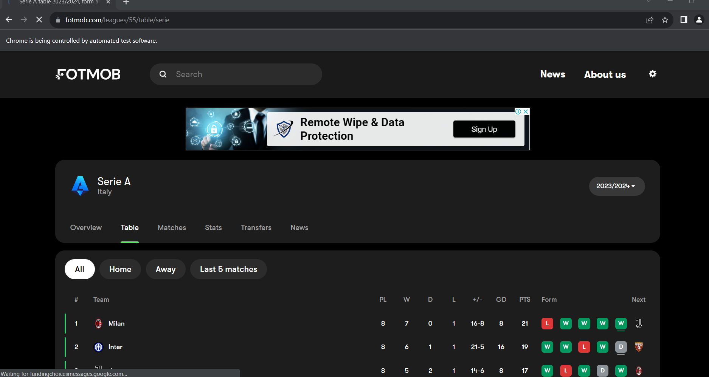
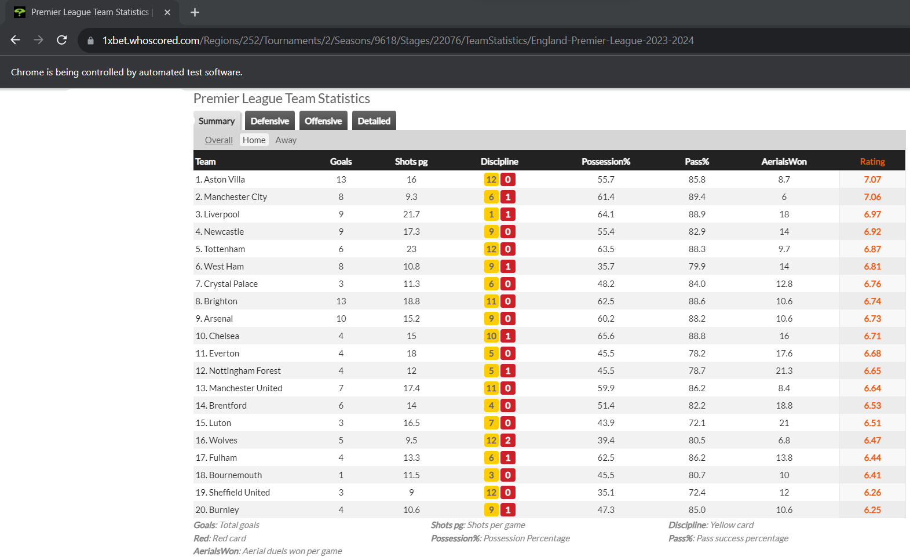
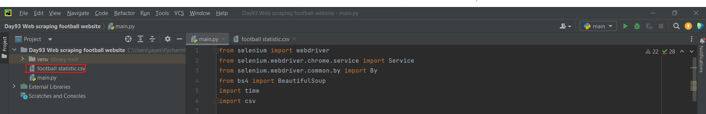

# ⚽️ Football Web Scraping Project

🔍 This project involves automating web scraping of football-related data from websites like whoscored.com and footmob.com. It collects information such as team standings, next matches, form, statistics, and head-to-head data, and compiles it into a CSV file for further analysis.

## Purpose
🎯 The purpose of this project is to collect football-related data from various websites and consolidate it into a structured format for further analysis. This data can be used for sports analytics, betting strategies, or any other football-related research.

## Prerequisites
- Python 3.x installed on your system.
- Selenium and BeautifulSoup libraries installed. You can install them using pip: `pip install selenium`, `pip install beautifulsoup4`
- A web driver for your browser (e.g., Chrome or Firefox). Make sure the web driver is compatible with your browser version.
- `chromedriver.exe` (or other web driver files): Required for Selenium to automate web interactions.

## Usage
- Selenium: Used for web automation and interaction with dynamic websites.
- BeautifulSoup: Used for parsing HTML content and extracting relevant data.
- CSV Module: Used to store data scrapped by using bs4 in csv format which can be later used accordingly.

## Example of Application

### Web Driver interface 1 (footmob.com):

### Web Driver interface 2 (whoscored.com):

### CSV file download:

## Please Note
- 🔄 The elements in the browser may change from time to time and hence we have to rectify the code from time to time if such a situation arises.
- 🚫 While automation process goes on some pages might not be accessible. In such cases we have to change the link manually or find a solution for such inconveniences.
